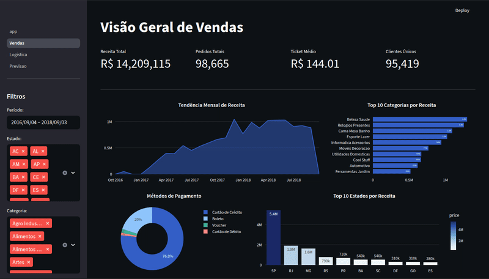

# Dashboard de Performance de Vendas para E-commerce


Este projeto apresenta um dashboard interativo e multi-páginas para a análise de dados de e-commerce, utilizando o dataset público da Olist. A aplicação foi desenvolvida inteiramente em Python com a biblioteca Streamlit, focando em performance, clareza visual e insights de negócio acionáveis.

O dashboard é dividido em três seções principais: Vendas, Logística e Previsão de Receita, permitindo uma análise completa da operação.

---

### Demo do Dashboard

O GIF abaixo demonstra a interatividade e as principais funcionalidades da aplicação. Ele está localizado na pasta `assets/` do projeto.



---

## Principais Funcionalidades

### 📊 Página 1: Análise de Vendas

Uma visão geral da performance comercial, projetada para caber em uma única tela sem rolagem.

- **KPIs Principais:** Receita Total, Pedidos Totais, Ticket Médio e Clientes Únicos.
- **Tendência Temporal:** Gráfico de área mostrando a evolução da receita ao longo do tempo.
- **Análise de Categorias:** Gráfico de barras com as 10 categorias de produtos mais rentáveis.
- **Métodos de Pagamento:** Gráfico de pizza mostrando a distribuição do uso dos métodos de pagamento.
- **Performance Geográfica:** Gráfico de barras com os 10 estados que mais geram receita.

### 🚚 Página 2: Análise de Logística

Um dashboard focado na eficiência das entregas, um fator crítico para o sucesso de um e-commerce.

- **KPIs de Logística:** Tempo Médio de Entrega, Tempo Estimado e Percentual de Entregas Atrasadas.
- **Performance de Entrega:** Gráfico de pizza que compara entregas realizadas no prazo vs. com atraso.
- **Evolução do Tempo de Entrega:** Gráfico de linha que monitora a variação do tempo médio de entrega ao longo dos meses.
- **Análise Geográfica de Entregas:** Gráficos de barras destacando os estados com os maiores tempos de entrega e maiores percentuais de atraso.

### 📈 Página 3: Previsão de Receita

Uma página dedicada à análise preditiva, utilizando Machine Learning para prever a receita futura.

- **Parâmetros Interativos:** Slider para definir o horizonte de previsão (de 1 a 12 meses).
- **Modelo de Machine Learning:** Utiliza a biblioteca `Prophet` (do Meta) para treinar um modelo de séries temporais com os dados históricos de vendas diárias.
- **Visualização da Previsão:** Gráfico interativo que plota os dados históricos, a previsão futura e o intervalo de confiança.
- **Análise de Componentes:** Gráficos separados que decompõem a previsão em seus componentes principais: tendência geral, sazonalidade anual e sazonalidade semanal.

---

## 🛠️ Tecnologias Utilizadas

- **Linguagem:** Python
- **Dashboard Interativo:** Streamlit
- **Manipulação de Dados:** Pandas
- **Visualização de Dados:** Plotly Express & Plotly Graph Objects
- **Machine Learning (Previsão):** Prophet
- **Otimização de Dados:** PyArrow, FastParquet

---

## 📂 Estrutura do Projeto

O projeto utiliza a arquitetura nativa de multi-páginas do Streamlit para uma organização clara e escalável.

```
dashboard_vendas/
├── assets/
│   └── demo.gif                  # Mídia do projeto
├── data/
│   ├── olist_..._dataset.csv       # Arquivos originais (opcional)
│   └── olist_..._dataset.parquet   # Arquivos otimizados
├── pages/
│   ├── 1_Vendas.py
│   ├── 2_Logistica.py
│   └── 3_Previsao.py
├── app.py                          # Página inicial
├── converter.py                    # Script para otimização dos dados
├── style_config.py                 # Módulo de estilização centralizado
├── requirements.txt
└── README.md
```

---

## 🚀 Como Executar o Projeto Localmente

Siga os passos abaixo para rodar o dashboard no seu computador.

**1. Clone o Repositório:**

```
git clone https://github.com/rianemilio/streamlit-ecommerce-dashboard.git
cd streamlit-ecommerce-dashboard
```

**2. Obtenha os Dados:**

- Baixe o [Brazilian E-Commerce Public Dataset by Olist](https://www.kaggle.com/datasets/olistbr/brazilian-ecommerce) do Kaggle.
- Extraia os arquivos `.csv` e coloque-os dentro da pasta `data/`.

**3. Crie um Ambiente Virtual e Ative-o:**

```
# Para MacOS/Linux
python3 -m venv venv
source venv/bin/activate

# Para Windows
python -m venv venv
.\venv\Scripts\activate
```

**4. Instale as Dependências:**

```
pip install -r requirements.txt
```

**5. Otimize os Dados:**
Para garantir a melhor performance, execute o script de conversão que irá transformar os arquivos CSV para o formato Parquet.

```
python converter.py
```

**6. Execute o Dashboard:**

```
streamlit run app.py
```

O dashboard abrirá automaticamente no seu navegador.
